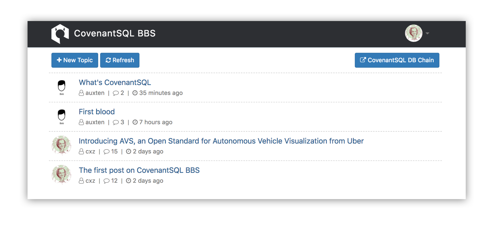

# CovenantForum

CovenantForum is a simple **decentralized** forum web app powered by [CovenantSQL](https://github.com/CovenantSQL/CovenantSQL).

## Decentralized forum?

- Data and files are saved in **decentralized database**. Anyone with a permission granted private key and the DSN(Database Serial Num) can serve the forum anywhere.
- Also, all posts related data are saved on an unique `SQLChain Block` like [this](https://explorer.dbhub.org/dbs/e08d944b4ebd69e12aa69dade1798bb98cea4e2833e55fb6decc1f447fc720a4/requests/f39f9cb46c2821f6354d001fea9a5eaf2b96b06e83c218d46d810f353a039ec8).
- Anyone can create your "blockchain powered forum" with just few steps.

## Features

- Static files and database are powered by decentralized database: CovenantSQL.
- REST API backend written in Go
- Vue.js-based frontend
- Social login (OAuth 2.0) via three providers:
  - Google
  - Facebook
  - Github
- JSON Web Tokens (JWT) are used for user authentication in the API
- Single binary deploy. All the static assets (frontend JavaScript & CSS files) are embedded into the binary
- Markdown comments
- Avatar upload, including animated GIFs. Auto-generated letter-avatars on user creation
 
## Arch

Comparison between Traditional and Decentralized forum:


## Demo 

[Demo forum](https://demo.covenantsql.io/forum/)


## Getting Started
  * [Generate a CovenantSQL config and keypair](https://github.com/CovenantSQL/CovenantSQL/wiki/Testnet-Quickstart).
  * Get PTC by replying to the [topic](https://demo.covenantsql.io/forum/#/t/2) with your wallet address. 
  * Create a new empty CovenantSQL database with [cql](https://github.com/CovenantSQL/CovenantSQL/wiki/Testnet-Quickstart#4-create-a-database-using-cli).

  * Obtain OAuth 2.0 credentials (client_id and secret) from at least one of the providers (Google, Facebook, Github) so users can log into the web application. The OAuth callback url will be `<base_url>/oauth/end/<provider>`. The `<base_url>` is where the bebop web app will be mounted on your site and the `<provider>` is the lowercase provider name. For example, if base_url is `https://my.website.com/forum/`, then the oauth callback url for google will be `https://my.website.com/forum/oauth/end/google`.

  * Download and compile the bebop binary:
    ```
    $ go get -u github.com/CovenantSQL/bebop/cmd/bebop
    ```

  * Inside an empty directory run:
    ```
    $ bebop init
    ```
    This will generate an initial configuration file "bebop.conf" inside the current dir.
    Edit the configuration file to set the server listen address, the base url, the database and file storage parameters, OAuth credentials, etc.

  * Run the following command to start the bebop web server.
    ```
    $ bebop start
    ```

  * Sign in into your web application using one of the social login providers.
    Then run the following command to grant admin privileges to your user.
    ```
    $ bebop add-admin <your-username>
    ```

## Screenshots

### Topics



### Comments


## Todo

- Make creating new forum easier.
- Grant low permission on forum database.
- We are working on [CovenantSQL](https://github.com/CovenantSQL/CovenantSQL).

## License

- Most code is derivated from a simple traditional forum [disintegration/bebop](https://github.com/disintegration/bebop)