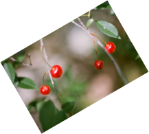
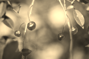
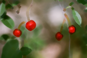
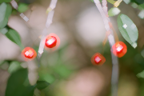
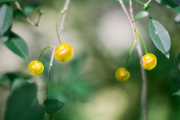

# GO IMAGE FILTERING TOOLKIT (GIFT)

[](https://godoc.org/github.com/disintegration/gift)
[](https://travis-ci.org/disintegration/gift)
[](https://coveralls.io/github/disintegration/gift?branch=master)
[](https://goreportcard.com/report/github.com/disintegration/gift)


*Package gift provides a set of useful image processing filters.*

Pure Go. No external dependencies outside of the Go standard library.


### INSTALLATION / UPDATING

    go get -u github.com/disintegration/gift


### DOCUMENTATION

http://godoc.org/github.com/disintegration/gift


### QUICK START

```go
// 1. Create a new filter list and add some filters.
g := gift.New(
	gift.Resize(800, 0, gift.LanczosResampling),
	gift.UnsharpMask(1, 1, 0),
)

// 2. Create a new image of the corresponding size.
// dst is a new target image, src is the original image.
dst := image.NewRGBA(g.Bounds(src.Bounds()))

// 3. Use the Draw func to apply the filters to src and store the result in dst.
g.Draw(dst, src)
```

### USAGE

To create a sequence of filters, the `New` function is used:
```go
g := gift.New(
	gift.Grayscale(),
	gift.Contrast(10),
)
```
Filters also can be added using the `Add` method:
```go
g.Add(GaussianBlur(2))
```

The `Bounds` method takes the bounds of the source image and returns appropriate bounds for the destination image to fit the result (for example, after using `Resize` or `Rotate` filters).

```go
dst := image.NewRGBA(g.Bounds(src.Bounds()))
```

There are two methods available to apply these filters to an image:

- `Draw` applies all the added filters to the src image and outputs the result to the dst image starting from the top-left corner (Min point).
```go
g.Draw(dst, src)
```

- `DrawAt` provides more control. It outputs the filtered src image to the dst image at the specified position using the specified image composition operator. This example is equivalent to the previous:
```go
g.DrawAt(dst, src, dst.Bounds().Min, gift.CopyOperator)
```

Two image composition operators are supported by now:
- `CopyOperator` - Replaces pixels of the dst image with pixels of the filtered src image. This mode is used by the Draw method.
- `OverOperator` - Places the filtered src image on top of the dst image. This mode makes sence if the filtered src image has transparent areas.

Empty filter list can be used to create a copy of an image or to paste one image to another. For example:
```go
// Create a new image with dimensions of the bgImage.
dstImage := image.NewRGBA(bgImage.Bounds())
// Copy the bgImage to the dstImage.
gift.New().Draw(dstImage, bgImage)
// Draw the fgImage over the dstImage at the (100, 100) position.
gift.New().DrawAt(dstImage, fgImage, image.Pt(100, 100), gift.OverOperator)
```


### SUPPORTED FILTERS

+ Transformations

    - Crop(rect image.Rectangle)
    - CropToSize(width, height int, anchor Anchor)
    - FlipHorizontal()
    - FlipVertical()
    - Resize(width, height int, resampling Resampling)
    - ResizeToFill(width, height int, resampling Resampling, anchor Anchor)
    - ResizeToFit(width, height int, resampling Resampling)
    - Rotate(angle float32, backgroundColor color.Color, interpolation Interpolation)
    - Rotate180()
    - Rotate270()
    - Rotate90()
    - Transpose()
    - Transverse()

+ Adjustments & effects

    - Brightness(percentage float32)
    - ColorBalance(percentageRed, percentageGreen, percentageBlue float32)
    - ColorFunc(fn func(r0, g0, b0, a0 float32) (r, g, b, a float32))
    - Colorize(hue, saturation, percentage float32)
    - ColorspaceLinearToSRGB()
    - ColorspaceSRGBToLinear()
    - Contrast(percentage float32)
    - Convolution(kernel []float32, normalize, alpha, abs bool, delta float32)
    - Gamma(gamma float32)
    - GaussianBlur(sigma float32)
    - Grayscale()
    - Hue(shift float32)
    - Invert()
    - Maximum(ksize int, disk bool)
    - Mean(ksize int, disk bool)
    - Median(ksize int, disk bool)
    - Minimum(ksize int, disk bool)
    - Pixelate(size int)
    - Saturation(percentage float32)
    - Sepia(percentage float32)
    - Sigmoid(midpoint, factor float32)
    - Sobel()
    - Threshold(percentage float32)
    - UnsharpMask(sigma, amount, threshold float32)


### FILTER EXAMPLES

The original image:


Resulting images after applying some of the filters:

 name / result                              | name / result                              | name / result                              | name / result
--------------------------------------------|--------------------------------------------|--------------------------------------------|--------------------------------------------
resize                                      | crop_to_size                               | rotate_180                                 | rotate_30
                |          |            | 
brightness_increase                         | brightness_decrease                        | contrast_increase                          | contrast_decrease
   |   |     | 
saturation_increase                         | saturation_decrease                        | gamma_1.5                                  | gamma_0.5
   |   |             | 
gaussian_blur                               | unsharp_mask                               | sigmoid                                    | pixelate
         |          |               | 
colorize                                    | grayscale                                  | sepia                                      | invert
              |             |                 | 
mean                                        | median                                     | minimum                                    | maximum
                  |                |               | 
hue_rotate                                  | color_balance                              | color_func                                 | convolution_emboss
            |         |            | 

Here's the code that produces the above images:

```go
package main

import (
	"image"
	"image/color"
	"image/png"
	"log"
	"os"

	"github.com/disintegration/gift"
)

func main() {
	src := loadImage("testdata/src.png")

	filters := map[string]gift.Filter{
		"resize":               gift.Resize(100, 0, gift.LanczosResampling),
		"crop_to_size":         gift.CropToSize(100, 100, gift.LeftAnchor),
		"rotate_180":           gift.Rotate180(),
		"rotate_30":            gift.Rotate(30, color.Transparent, gift.CubicInterpolation),
		"brightness_increase":  gift.Brightness(30),
		"brightness_decrease":  gift.Brightness(-30),
		"contrast_increase":    gift.Contrast(30),
		"contrast_decrease":    gift.Contrast(-30),
		"saturation_increase":  gift.Saturation(50),
		"saturation_decrease":  gift.Saturation(-50),
		"gamma_1.5":            gift.Gamma(1.5),
		"gamma_0.5":            gift.Gamma(0.5),
		"gaussian_blur":        gift.GaussianBlur(1),
		"unsharp_mask":         gift.UnsharpMask(1, 1, 0),
		"sigmoid":              gift.Sigmoid(0.5, 7),
		"pixelate":             gift.Pixelate(5),
		"colorize":             gift.Colorize(240, 50, 100),
		"grayscale":            gift.Grayscale(),
		"sepia":                gift.Sepia(100),
		"invert":               gift.Invert(),
		"mean":                 gift.Mean(5, true),
		"median":               gift.Median(5, true),
		"minimum":              gift.Minimum(5, true),
		"maximum":              gift.Maximum(5, true),
		"hue_rotate":           gift.Hue(45),
		"color_balance":        gift.ColorBalance(10, -10, -10),
		"color_func": gift.ColorFunc(
			func(r0, g0, b0, a0 float32) (r, g, b, a float32) {
				r = 1 - r0   // invert the red channel
				g = g0 + 0.1 // shift the green channel by 0.1
				b = 0        // set the blue channel to 0
				a = a0       // preserve the alpha channel
				return r, g, b, a
			},
		),
		"convolution_emboss": gift.Convolution(
			[]float32{
				-1, -1, 0,
				-1, 1, 1,
				0, 1, 1,
			},
			false, false, false, 0.0,
		),
	}

	for name, filter := range filters {
		g := gift.New(filter)
		dst := image.NewNRGBA(g.Bounds(src.Bounds()))
		g.Draw(dst, src)
		saveImage("testdata/dst_"+name+".png", dst)
	}
}

func loadImage(filename string) image.Image {
	f, err := os.Open(filename)
	if err != nil {
		log.Fatalf("os.Open failed: %v", err)
	}
	img, _, err := image.Decode(f)
	if err != nil {
		log.Fatalf("image.Decode failed: %v", err)
	}
	return img
}

func saveImage(filename string, img image.Image) {
	f, err := os.Create(filename)
	if err != nil {
		log.Fatalf("os.Create failed: %v", err)
	}
	err = png.Encode(f, img)
	if err != nil {
		log.Fatalf("png.Encode failed: %v", err)
	}
}
```
